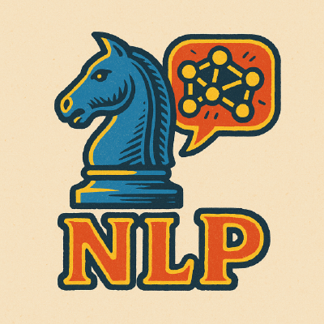
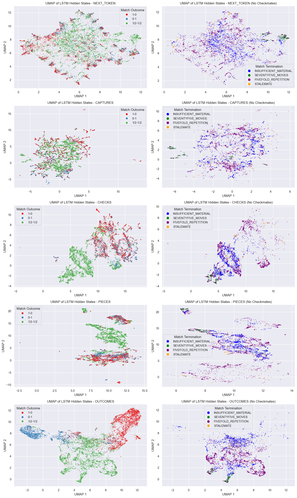
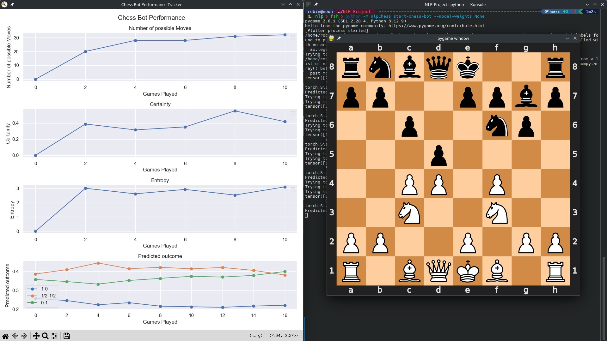

*April 2025 - Mai 2025*

---

{ width="800" height="600" style="display: block; margin: 0 auto"        }

*Exploring the linguistic patterns hidden in the royal game through machine learning*

## Introduction   

What if chess moves could be treated as words in a sentence? What stories might emerge from the strategic dance between kings and pawns? These were the questions that drove our team of four through an exciting Natural Language Processing project at Politecnico di Milano, under the guidance of Professor Mark Carman.

Our journey began with a simple yet profound hypothesis: chess games, recorded in standard UCI notation, might exhibit linguistic properties similar to natural languages. Armed with a dataset of chess games played by Stockfish against itself, we embarked on an investigation that would take us from Shakespeare's English to word embeddings, from sequence prediction to building our own chess-playing bot.

## The Dataset: Stockfish vs. Stockfish

Our foundation was a rich collection of chess games in UCI (Universal Chess Interface) format, where the world's strongest chess engine battled against itself. Each game came with valuable metadata including game outcomes and termination reasons. This self-play approach eliminated human bias and inconsistency, giving us a pure distillation of optimal chess strategy translated into move sequences.

The UCI format provided us with a clean, tokenizable representation of chess moves – each move essentially becoming a "word" in our chess "language." Moves like "e2e4" (pawn to e4) became the vocabulary of our linguistic analysis.

## Research Questions: From Language to Strategy

Our investigation centered around several compelling research questions:

### 1. Chess as Natural Language
Can chess games be meaningfully described as a natural language? To answer this, we conducted comparative analyses between chess move sequences and English text, specifically examining works of Shakespeare. We measured statistical properties like token frequency distributions, sequence lengths, and pattern repetition to quantify the linguistic nature of chess.

### 2. Information Extraction from Chess Notation
How much strategic information can we extract from move sequences compared to the complete game state? We developed models to predict various chess-specific features directly from notation:

- Piece captures  
- Piece movements and positioning
- Check situations
- Game outcomes

We also looked into the game embeddings (last hidden state) and see if the hidden state also learns features which could be also used to predict other labels like the reason for termination (checkmate, stalemate, insufficient material, ...)

### 3. Move Embeddings and Clustering
We applied Word2Vec to chess moves, creating dense vector representations that capture strategic relationships. Clustering these embeddings revealed fascinating patterns – moves that often appear in similar contexts (like opening sequences or endgame techniques) naturally grouped together, suggesting that our "chess vocabulary" had learned meaningful strategic concepts.

## The Chess Bot: Next-Token Prediction Meets Strategy

Perhaps our most entertaining application was a chess bot built on next-token prediction using a small-scale LSTM. This bot approached chess not as a traditional search problem, but as a language modeling task – predicting the most likely next "word" (move) given the conversation (game) so far.         

To make the bot's decision-making transparent, we implemented several interpretability features:
- **Move Certainty**: How confident the model is about its chosen move
- **Move Entropy**: The uncertainty across all possible moves, indicating position complexity  
- **Win Probability**: Real-time assessment of winning chances from the current position

Watching this bot play was like observing someone who had learned chess by reading 70.000 games without ever seeing a board – sometimes brilliant, sometimes baffling, but always following patterns it had learned from the data. By playing with the bot we found the bot is lacking robustness in a sense that if you play not optimal (and move the move sequence out of distribution) then the bot is also not playing optimal because the bot has not seen a move sequence like this before and does not know what to predict in those cases.

## My Deep Dive: Sequence Prediction Architectures

My primary contribution focused on training recurrent neural networks for multiple prediction tasks simultaneously. The goal was ambitious: build models that could predict next moves, piece movements, captures, checks, and even game outcomes from incomplete games.

### The Architecture Journey
I began with what I thought would be a sophisticated approach, experimenting with various architectures:
- **LSTM**: The reliable workhorse of sequence modeling
- **GRU**: A more efficient alternative to LSTM
- **MiniGRU**: Inspired by the "Were RNNs All We Needed?" paper, though frustratingly unstable during training
- **Transformer**: The state-of-the-art attention-based architecture

### The Surprising Lesson: Simplicity Wins

Here's where the project taught me a humbling lesson about machine learning. Despite my initial inclination toward complexity, the simplest LSTM architecture consistently outperformed more sophisticated models. Scaling up and adding complexity didn't just fail to improve performance – it actively hurt accuracy.

This counterintuitive result challenged my assumptions about model capacity and task complexity. In retrospect, chess notation might be structured enough that simple recurrent architectures can capture the essential patterns without requiring the representational power of more complex models. The lesson was clear: sometimes the most elegant solution is also the simplest.

The training difficulties with more complex architectures were particularly puzzling. Sequence models that should have benefited from additional capacity became harder to optimize and less accurate. This experience reinforced the importance of starting simple and scaling complexity only when justified by performance gains.

## Team Dynamics: A Rare University Experience

Working on this project was refreshingly different from typical university group work. All four team members were genuinely committed to producing quality results and meeting deadlines. The collaborative energy was infectious – everyone brought unique perspectives and skills that enriched the final outcome.

Despite our collective enthusiasm, the project's scope was perhaps overly ambitious for our time constraints. We touched on many fascinating aspects – from linguistic analysis to deep learning architectures to interpretable AI – but the tight schedule prevented us from diving as deep as we would have liked into any single area.

## What We Wished We Could Explore Further

Given unlimited time, several directions beckoned:

**Generalization Capabilities**: How well do fine-tuned language models trained on chess notation generalize to different playing styles or time controls? Could a model trained on rapid games understand classical chess?

**Dedicated Small-Scale Predictors**: Rather than trying to solve everything with one model, what could we achieve with specialized architectures designed for specific chess tasks?

**Transfer Learning**: Could chess-trained language models transfer knowledge to other strategic games or even back to natural language tasks?

**Temporal Dynamics**: How do model predictions change as games progress from opening through middlegame to endgame?

## Conclusions and Reflections

This project demonstrated that chess notation does indeed exhibit linguistic properties that can be leveraged by NLP techniques. The success of our Word2Vec embeddings and sequence prediction models suggests that chess moves follow distributional patterns similar to words in natural language.

The interpretability features we built into our chess bot point toward a future where AI decision-making in strategic domains becomes more transparent and explainable. Understanding not just what move an AI chooses, but how certain it is and what alternatives it considered, could transform how we interact with AI systems.

Most importantly, this project reminded me that in machine learning, as in chess, sometimes the most straightforward approach is the strongest. The elegance of a simple, well-executed strategy often trumps the complexity of an over-engineered solution.

---

*This project was completed as part of the Natural Language Processing course at Politecnico di Milano under Professor Mark Carman. Special thanks to my three teammates who made this exploration both productive and enjoyable.*

## Technical Details

For those interested in replicating or extending this work:
- **Dataset**: Stockfish self-play games in UCI format found on [hugging-face](https://huggingface.co/datasets/laion/strategic_game_chess     )
- **Primary Architecture**: Single-layer LSTM with embedding layers
- **Evaluation Metrics**: Prediction accuracy for various chess-specific tasks
- **Implementation**: Python with PyTorch for deep learning components

The code and detailed results are available [GitHub](https://github.com/NLP-Project-PoliMi-2025/NLP-Project/).

----- 
I have  written this blog post jointly with Claude.ai and in the retrospective as I setup my webpage in mid-early 2025.
